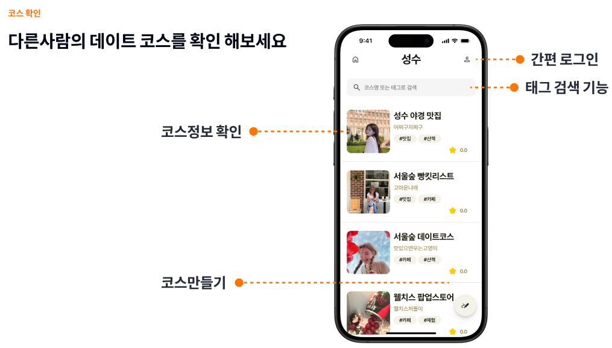
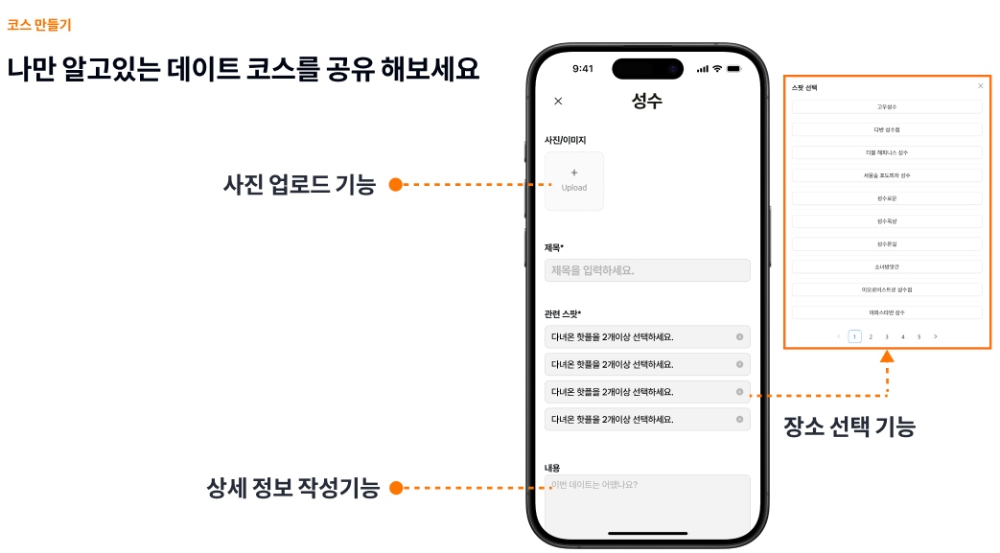

# DATEPEEK: 지역 기반 데이트 스팟 공유 서비스

**DATEPEEK**는 사용자가 직접 데이트 코스를 만들고 공유할 수 있는 플랫폼입니다. 다양한 데이트 경험을 공유하며 데이트 계획의 스트레스를 최소화하는 것이 목표입니다.

## 팀 구성 및 개발 일정

- **팀원**: 프론트엔드 1명 (sooooooool), 백엔드 1명 (yeyeyey), 기획 3명  
- **개발 기간**: 2024.08.02 ~ 2024.09.30
- **Front**: [프론트엔드 GitHub 저장소](https://github.com/yeyeyey3941/q2_project_front_clone)

## 서비스 목표

DATEPEEK는 사용자의 데이트 경험을 공유하여, 데이트 계획에 드는 고민과 스트레스를 줄여주는 서비스입니다.

## 주요 기능

### 1. **지역 선택**
   사용자가 원하는 데이트 핫플 지역을 선택할 수 있습니다.
   

### 2. **데이트 코스 확인**
   다른 사용자가 작성한 데이트 코스를 확인할 수 있으며, 관련된 정보를 제공합니다.
   

### 3. **코스 상세 페이지**
   코스의 이미지, 정보, 경로 등을 확인하고 댓글로 다른 사용자와 소통할 수 있습니다.
   

### 4. **사용자 평가**
   데이트 코스에 대한 별점 평가와 댓글을 작성할 수 있습니다.
   

### 5. **코스 만들기**
   사진 업로드, 제목 작성, 관련 스팟 선택을 통해 나만의 데이트 코스를 만들 수 있습니다.
   

## 기술 스택

- **Node.js**: 서버 사이드 JavaScript 런타임
- **Express.js**: 웹 프레임워크
- **Sequelize**: ORM(Object-Relational Mapping) 라이브러리
- **MySQL**: 관계형 데이터베이스
- **Passport**: OAuth 인증을 위한 라이브러리
- **REST API**: 데이터 통신 방식

## 프로젝트 구조

### 폴더 구조
```bash
src/
├── assets/           # Static files (이미지, 스타일 등)
├── controllers/      # 비즈니스 로직 처리 및 API 요청 핸들링
├── middlewares/      # 인증, 에러 핸들링 미들웨어
├── models/           # Sequelize ORM 모델 정의
├── passport/         # OAuth 소셜 로그인 설정
├── routes/           # API 엔드포인트 라우팅
├── services/         # 비즈니스 로직 처리
└── app.js            # 서버 초기화 및 설정 파일
```

### 주요 폴더 및 파일 설명
- **`controllers/`**: 각 도메인에 대한 비즈니스 로직을 처리하며, API 요청에 대한 응답을 반환합니다.
- **`middlewares/`**: 인증, 에러 핸들링 등 요청 과정에서 수행되는 미들웨어를 포함합니다.
- **`models/`**: 데이터베이스의 테이블을 정의하며, Sequelize 모델을 사용해 데이터베이스와 상호작용합니다.
- **`passport/`**: 소셜 로그인과 관련된 로직을 정의하며, Passport.js를 사용하여 소셜 로그인 전략을 설정합니다.
- **`routes/`**: 클라이언트 요청 URL을 처리할 라우터를 정의합니다.
- **`services/`**: 데이터 처리 및 비즈니스 로직을 수행하는 서비스 레이어입니다.
- **`app.js`**: 애플리케이션의 진입점으로 서버를 초기화하고 필요한 미들웨어, 라우터를 설정합니다.

## 설치 및 실행

### 1. 프로젝트 클론 및 디렉토리 이동
```bash
git clone https://github.com/Yejun3941/Q2_Project_Back.git
cd backend
```

### 2. 의존성 설치
```bash
npm install
```

### 3. 환경 변수 설정
```bash
touch .env
```
`.env` 파일에 데이터베이스 정보, 시크릿, OAuth 정보 등을 설정합니다.

### 4. 서버 실행
```bash
npm start
```
또는 PM2를 사용하여 서버 실행
```bash
pm2 start app.js --name "datepeek-server"
```

## API 문서

### 코스 등록 API

- **Endpoint**: `POST /course-api`
- **설명**: 새로운 데이트 코스를 등록합니다.
- **Request Body**:
  ```json
  {
    "F_User_id": 1,
    "Course_title": "성수 데이트 코스",
    "Course_content": "성수에서 즐길 수 있는 3곳의 핫플!",
    "F_Course_Location": 1,
    "spots": [101, 102, 103]
  }
  ```
- **Response** (성공 시):
  ```json
  {
    "success": true,
    "message": "Course created successfully",
    "data": {
      "id": 1,
      "F_User_id": 1,
      "Course_title": "성수 데이트 코스",
      "Course_content": "성수에서 즐길 수 있는 3곳의 핫플!",
      "F_Course_Location": 1,
      "createdAt": "2024-09-10T12:34:56.789Z",
      "updatedAt": "2024-09-10T12:34:56.789Z"
    }
  }
  ```
- **Response** (실패 시):
  ```json
  {
    "success": false,
    "message": "Failed to create course",
    "error": "Validation error"
  }
  ```

### 스팟 목록 조회 API

- **Endpoint**: `GET /spot-api`
- **설명**: 사용 가능한 스팟 목록을 조회합니다.
- **Query Parameters**:
  - `page`: 현재 페이지 (선택)
  - `pageSize`: 페이지당 항목 수 (선택)

- **Response** (성공 시):
  ```json
  {
    "success": true,
    "data": {
      "spots": [
        {
          "id": 101,
          "Spot_Name": "성수 카페거리"
        },
        {
          "id": 102,
          "Spot_Name": "성수 연무장길"
        }
      ],
      "total": 2
    }
  }
  ```

## GIT 규칙 - Commit 및 Branch 전략

### Commit 규칙

- **`타입(태그)`**: 커밋의 성격을 간결하게 나타냅니다.
- **`주제`**: 변경 사항을 요약합니다 (50자 이내).
- **`본문`**: 선택 사항으로, 커밋에 대한 추가 설명이나 이유, 세부사항을 포함할 수 있습니다. 본문은 한 줄 비워둔 뒤 작성하며, 각 줄은 72자를 넘지 않도록 합니다.
- **`이슈 번호`**: 관련된 이슈 번호를 명시합니다 (있을 경우).

### 커밋 메시지 타입(태그)

- **`feat`**: 새로운 기능 추가 (예: feat: Add payment processing module)
- **`fix`**: 버그 수정 (예: fix: Correct user login issue)
- **`refactor`**: 코드 리팩토링 (기능 변화 없음) (예: refactor: Optimize API response handling)
- **`style`**: 코드 스타일 수정 (포매팅, 세미콜론 추가 등) (예: style: Reformat code according to ESLint rules)
- **`docs`**: 문서 수정 (예: docs: Update API documentation for v2.0)
- **`test`**: 테스트 코드 추가 또는 수정 (예: test: Add unit tests for user service)
- **`chore`**: 빌드 또는 개발 도구 관련 작업 (예: chore: Update dependencies)
- **`perf`**: 성능 개선 (예: perf: Improve query performance for large datasets)
- **`ci`**: CI 설정 수정 (예: ci: Update GitHub Actions configuration)
- **`revert`**: 이전 커밋 되돌리기 (예: revert: Revert "feat: Add payment processing module")

### Git-flow 전략에 따른 커밋 예시
  
 **Feature 브랜치 작업**:
 - `feat`: Implement user registration form
 - `feat`: Add password validation logic

 **Bugfix 작업**:
 - `fix`: Resolve issue with login redirection
 - `fix`: Correct API endpoint path

  **Release 브랜치에서 버전 준비**:
 - `chore`: Prepare version 1.2.0 release
 - `docs`: Update CHANGELOG for 1.2.0 release

  **Hotfix 작업**:
 - `fix`: Critical bug in production environment
 - `revert`: Revert faulty migration script

### 커밋 메시지 작성 시 Best Practices
- **`작은 커밋`**: 커밋을 자주, 작은 단위로 나누어 기록합니다. 각 커밋은 독립적으로 이해될 수 있어야 합니다.
- **`의미 있는 메시지`**: 커밋 메시지는 코드 변경 내용만이 아닌, 변경의 이유도 설명해야 합니다.
- **`현재 시제 사용`**: 커밋 메시지는 현재 시제로 작성합니다. 예: "Added" 대신 "Add".
- **`관련 이슈 참조`**: 관련된 이슈 번호를 명시하여 변경 사항과 이슈를 연결합니다.

### 규약 준수
모든 팀원은 이 규칙을 준수하여 일관된 Git 커밋 메시지를 작성해야 하며, 이를 통해 프로젝트 관리와 협업이 원활하게 진행될 수 있도록 노력합니다. 규칙을 준수하지 않을 경우, 코드 리뷰에서 지적되어 수정 요청을 받을 수 있습니다.

### 이 규약은 팀 프로젝트의 성공적인 진행을 위해 만들어졌으며, 모든 팀원은 이를 숙지하고 준수해야 합니다.

## 팀 프로젝트 개발자 회고 및 인사이트

### 1. 시간 제약과 설계
- **설계 부족**: 기획이 미완성된 상태에서 시작
- **개선점**: 초기 기획 완성 후 작업 시작 필요

### 2. API 통합의 중요성
- **예상보다 긴 통합 작업**: 프론트와 백엔드 연동에 시간 소모
- **개선점**: API 명세서 작성 및 충분한 통합 작업 시간 확보

### 3. 기술적 인사이트: 데이터베이스 무결성과 효율성
- **무결성과 효율성 균형**: 성능 최적화 위해 평균 별점 저장 방식 도입
- **개선점**: 불필요한 연산 방지를 통한 성능 향상
